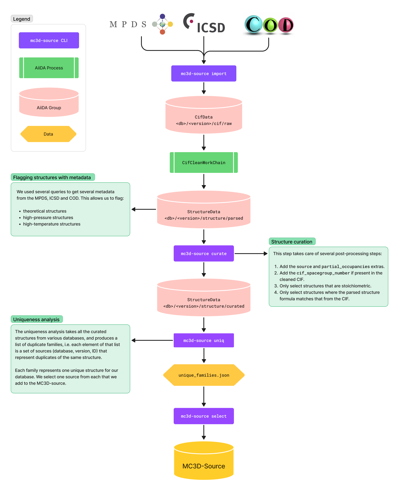

# Introduction

The `mc3d-source` package hosts all the code for MC3D-source pipeline, which produces the unique set of structures that are the starting point for all MC3D calculations.

## Pipeline

The following flowchart is from our [MC3D Figma board](https://www.figma.com/board/3XD0ypxD05WkstFdBMLhLt/MC3D-Pipeline?node-id=0-1&t=L6LQIvcVJS4KCoDY-1), and helps to understand the steps taken to obtain the MC3D-source:

