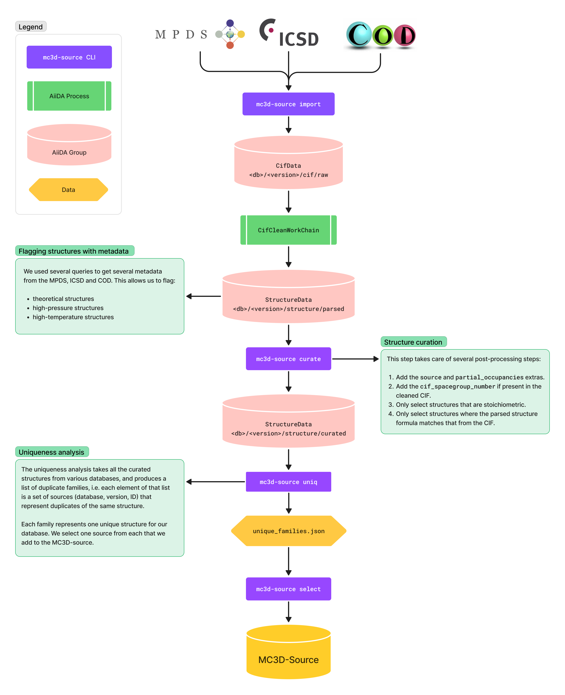

# Introduction

The `mc3d-source` package hosts the code for the [MC3D](https://mc3d.materialscloud.org/) source pipeline: the workflow that turns raw CIF dumps from external crystal structure databases (COD, ICSD, MPDS) into the unique, curated set of structures that seed all MC3D calculations.

For the scientific context, see the MC3D website and the accompanying paper in *Digital Discovery* ([Huber et al., 2026](https://pubs.rsc.org/en/content/articlelanding/2026/dd/d5dd00415b)).

## Pipeline

The following flowchart from our [MC3D Figma board](https://www.figma.com/board/3XD0ypxD05WkstFdBMLhLt/MC3D-Pipeline?node-id=0-1&t=L6LQIvcVJS4KCoDY-1) summarises the steps:

The package exposes a single CLI, `mc3d-source`, whose subcommands implement the stages in order:

1. **`import`** &mdash; fetch raw CIFs from a source database into AiiDA.
2. *(Cleaning step.)* The raw `CifData` are processed by `CifCleanWorkChain` runs, submitted in batch from the separate runner in `pipeline/cif_clean/` (not part of the installed package).
3. **`curate`** &mdash; from a group of completed `CifCleanWorkChain`, attach source/spacegroup/formula extras to the parsed `StructureData` and collect the clean ones into a curated group.
4. **`update`** &mdash; when re-importing an updated version of a source database, reconcile the new curated set against the previous one.
5. **`analyse`** &mdash; produce the per-source deprecation report (`id_removed`, `structure_updated`, `incorrect_formula`).
6. **`uniq`** &mdash; deduplicate structures across sources via `pymatgen`'s `StructureMatcher`, emit unique families as JSON.
7. **`select`** &mdash; pick the final MC3D structures from the unique families, taking the previous MC3D set and the deprecation report into account.

## Where to go next

- **[Usage](usage.md)** &mdash; worked examples of the stages above.
- **[Topics](topics.md)** &mdash; algorithmic notes and the data model (extras schema, source strings, deprecation lifecycle).
- **[Developer guide](developer.md)** &mdash; setup, pre-commit, tests, docs build.
